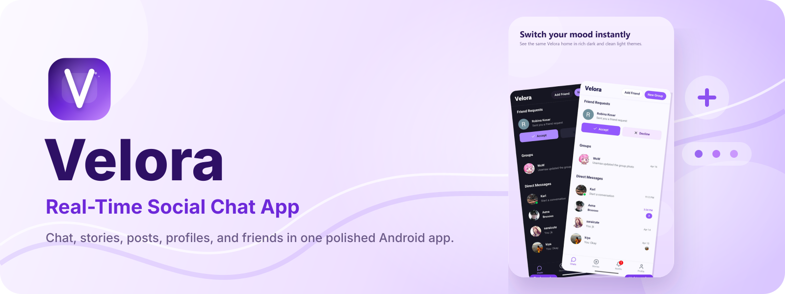
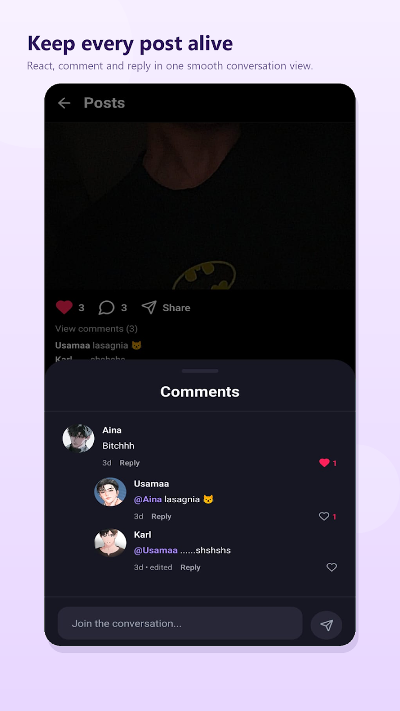
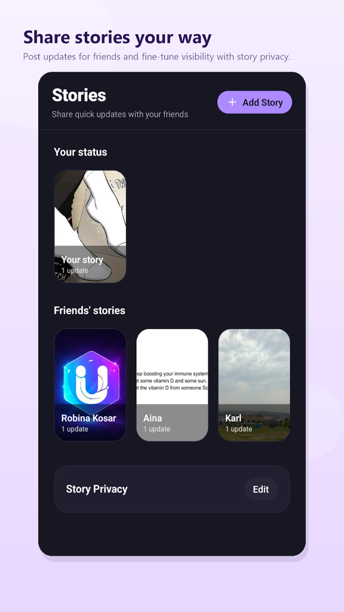
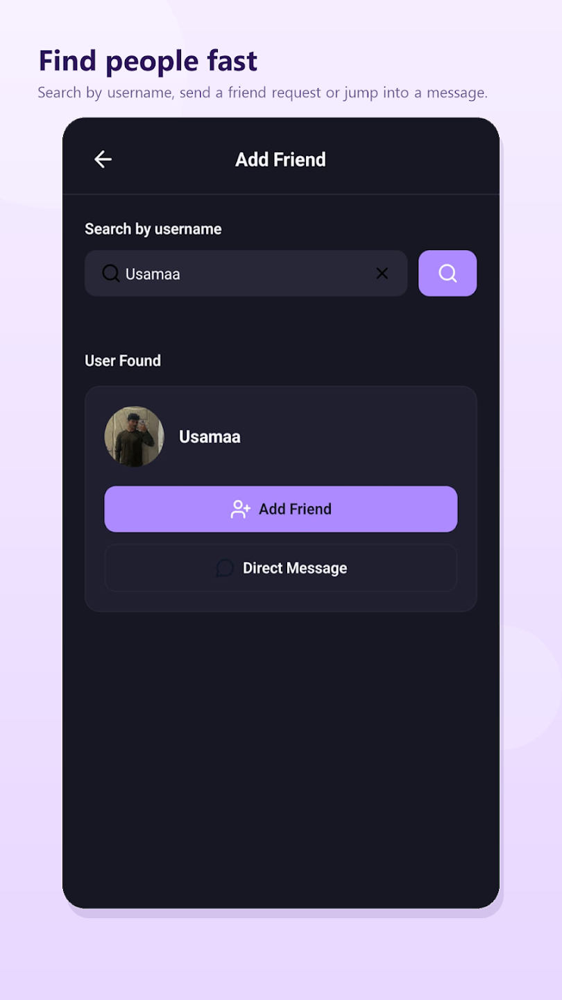
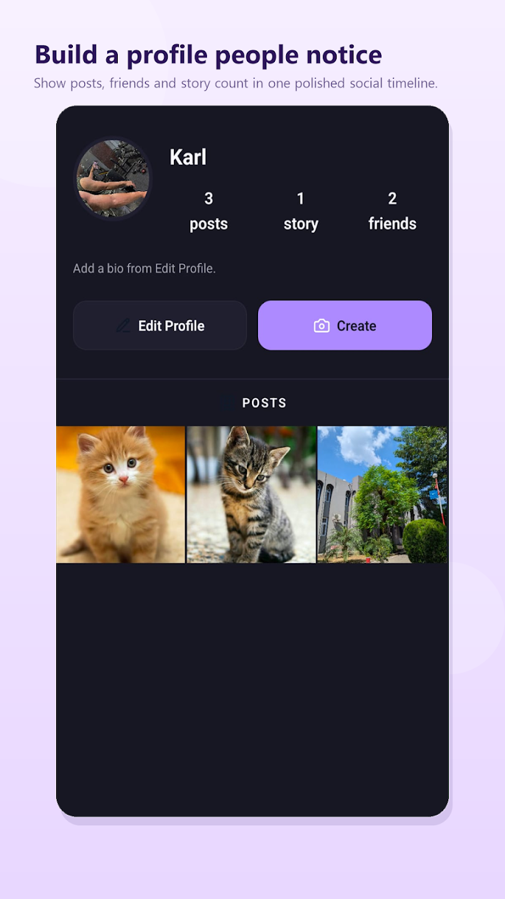

# 🚀 Velora — Real-Time Social Chat App

<p align="center">
  
</p>

## 📱 Available on Google Play

<p align="center">
  <a href="https://play.google.com/store/apps/details?id=com.velora.chat&hl=en">
    
  </a>
</p>

## 📸 Screenshots

<p align="center">
  
  
  
  
</p>

Velora is a modern, full-featured real-time chat application built with a focus on seamless communication and interactive social experiences. It combines messaging, media sharing, and social features like posts and stories into a single intuitive platform.

---

## ✨ Features

- 💬 Real-Time Messaging  
- 📸 Media Sharing  
- 👥 Friends & Groups System  
- ❤️ Message Reactions  
- 🧑‍💻 User Profiles  
- 📷 Posts (Instagram-style)  
- ⏳ Stories Feature  
- 🔔 Push Notifications  

---

## 🛠️ Tech Stack

- Frontend: React Native (Expo)  
- Backend: Firebase  
- Database: Firestore  
- Media Storage: Cloudinary  
- Notifications: Firebase Cloud Messaging (FCM)  


---

## 🚀 Future Improvements

- 📞 Voice & Video Calling  
- 🔒 End-to-End Encryption  
- 🌐 Web version  
- ⚡ Performance optimization  

---

## 👨‍💻 Developer: Usha Labs

## Get started

1. Install dependencies

   ```bash
   npm install
   ```

2. Start the app

   ```bash
   npx expo start
   ```

In the output, you'll find options to open the app in a

- [development build](https://docs.expo.dev/develop/development-builds/introduction/)
- [Android emulator](https://docs.expo.dev/workflow/android-studio-emulator/)

## 🔐 Note

Firebase configuration keys are required to run this project.  
Set up your own Firebase project and replace the config in the project files.
You can start developing by editing the files inside the **app** directory.

## Enjoy :3
